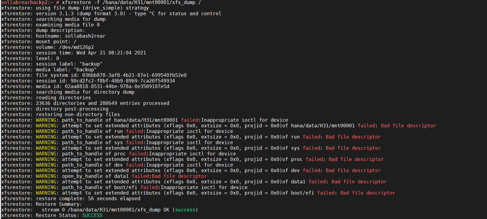
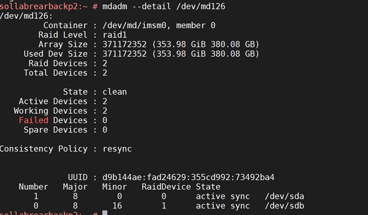
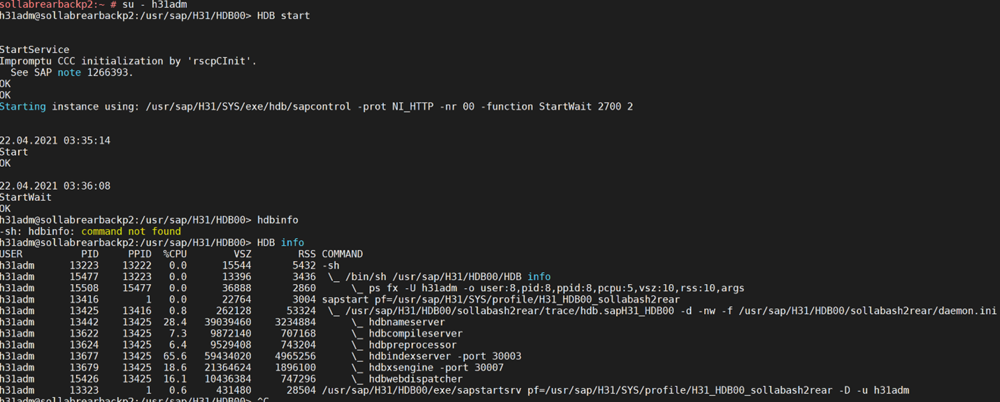

# OS backup and restore for Type II SKUs of Revision 3 stamps

This document describes the steps to perform an operating system file level backup and restore for the **Type II  SKUs** of the HANA Large Instances of Revision 3. 

>[!Important]
> **This article does not apply to Type II SKU deployments in Revision 4 HANA Large Instance stamps.** Boot LUNS of Type II HANA Large Instance units which are deployed in Revision 4 HANA Large Instance stamps can be backed up with storage snapshots as this is the case with Type I SKUs already in Revision 3 stamps


>[!NOTE]
> * The OS backup scripts uses xfsdump utility.  
> * This document supports complete Root filesystem backup and **no incremental** backups
> * Do ensure that while taking backups, there are no files being written actively to the system for which you will need a backup, since while the system is being backed up and there is a backup being performed it might not get updated in the backup.
> * This documentation replaces ReaR tool based backups.
> * This procedure has been tested inhouse for multiple OS corruption scenarios, since the customer is solely responsible for the OS, it is recommended that they test it out before relying on this documentation for their scenarios.
> * The process listed out has been tested out on SLES OS.
> * OS restore, with the process mentioned in this document is not possible without engaging Microsoft for a console access, please create a support ticket with Microsoft to assist in recovery.


## How to take a manual backup?

To perform a manual backup :

* Install the backup tool 
   ```
   zypper in xfsdump
   ```

* Create a backup 
   ```
   xfsdump -l 0 -f /data1/xfs_dump /
   ```

   The following screen show shows the sample manual backup:
   
   


* Save a copy of backup in NFS volumes as well, in the scenario where data1 partition also gets corrupted.
   ```
   cp /data1/xfs_dump /nfs_vol/
   ```

* For excluding regular directories and files from dump, please tag files with chattr
   * chattr -R +d directory
   * chattr +d file
   * Run xfsdump with “-e” option
   * Note, It is not possible to exclude nfs filesystems [ntfs]


## How to restore a backup?

>[!NOTE]
> * This step requires engaging Microsoft team.
> * We will be restoring the complete filesystem:

* Mount OS iso on the system 

* Enter rescue mode

* Mount data1 (or nfs volume, wherever the dump is stored) partition in read write mode
   ```
   mount -o rw /dev/md126p4 /mnt1
   ```
* Mount Root in read write mode
   ```
   mount -o rw /dev/md126p2 /mnt2
   ```
* Restore Filesystem 
   ```
   xfsrestore -f /mnt1/xfs_dump /mnt2
   ```
   
* Reboot the system
   ```
   reboot
   ```

* * In the scenario, any post checks fail, please engage OS vendor and Microsoft for a console access.

## Post Restore check

* Ensure the system has complete attributes restored.
   * Network is up
   * NFS volumes are mounted
* Ensure RAID is configured, please replace with your RAID device
   ```
   mdadm -D /dev/md126
   ```
   

* Ensure that RAID disks are synced and the configuration is in a clean state.
   * RAID disks take sometime in syncing and for the initial few minutes it will sync before it is 100% synced.

* Start HANA DB
   ```
   su - sidadm
   HDB start
   ```
* Ensure HANA comes up and there are no errors
   ```
   hdbinfo
   ```
   

* In the scenario, any post checks fail, please engage OS vendor and Microsoft for a console access.
