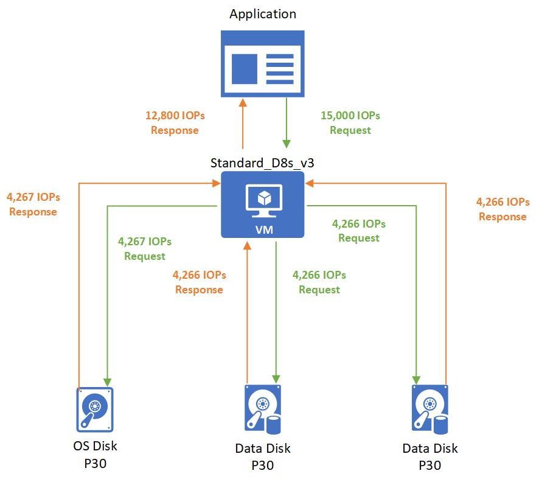

The max **uncached** disk throughput is the default storage maximum limit that the virtual machine can handle. The max **cached** storage throughput limit is the new limit when you enable host caching. Enabling host caching can be done when creating your virtual machine and attaching disks. You can also adjust to turn on and off host caching your disks on an existing VM:

The host caching can be adjusted to match your workload requirements for each disk. You can set your host caching to be Read-Only for workloads that only do reading operations and Read/Write for workloads that do a balance of read and write operations. If your workload doesn't follow either of those patterns, you unfortunately won't be able to use host caching. 

Let’s continue with an example with our Standard_D8s_v3 virtual machine. Except this time, we'll enable host caching and its new IOPS limit is 16,000 IOPS. Attached to the VM are three underlying P30 disks that can handle 5,000 IOPS.

Set up:
- Standard_D8s_v3 
    - Uncached IOPS: 16,000
- P30 OS Disk
    - IOPS: 5,000 
- P30 Data Disks 
    - IOPS: 5,000

Now, The application using this Standard_D8s_v3 virtual machine with caching enabled makes a request for 15,000 IOPS. Those requests are broken down as 5,000 IOPS to each underlying disk attached and no throttling occurs.

# Metrics for disk performance
We have metrics on Azure that provides insight on how your virtual machines and disks are performing. These metrics can be viewed visually through the Azure portal or they can be retrieved through an API call. Metrics are calculated over one-minute intervals. The following Metrics are available to get insight on VM and Disk IO and throughput performance:
- **OS Disk Queue Depth** – The number of current outstanding IO requests that waiting to be read from or written to the OS disk.
- **OS Disk Read Bytes/Sec** – The number of Bytes that are read in a second from the OS disk.
- **OS Disk Read Operations/Sec** – The number of input operations that are read in a second from the OS disk.
- **OS Disk Write Bytes/Sec** – The number of Bytes that are written in a second from the OS disk.
- **OS Disk Write Operations/Sec** – The number of output operations that are written in a second from the OS disk.
- **Data Disk Queue Depth** – The number of current outstanding IO requests that waiting to be read from or written to the data disk(s).
- **Data Disk Read Bytes/Sec** – The number of Bytes that are read in a second from the data disk(s).
- **Data Disk Read Operations/Sec** – The number of input operations that are read in a second from a data disk(s).
- **Data Disk Write Bytes/Sec** – The number of Bytes that are written in a second from the data disk(s).
- **Data Disk Write Operations/Sec** – The number of output operations that are written in a second from a data disk(s).
- **Disk Read Bytes/Sec** – The number of total Bytes that are read in a second from all disks attached to a VM.
- **Disk Read Operations/Sec** – The number of input operations that are read in a second from all disks attached to a VM.
- **Disk Write Bytes/Sec** – The number of Bytes that are written in a second from all disks attached to a VM.
- **Disk Write Operations/Sec** – The number of output operations that are written in a second from all disks attached to a VM.

# Throttling metrics
Metrics that help diagnose virtual machine throttling:
- **VM Cached IOPS Consumed Percentage** - the percentage calculated by the total IOPS completed over the provisioned cached virtual machine IOPS limit. If this amount is at 100%, you'll experience throttling from your VM's cached IOPS limit.
- **VM Cached Bandwidth Consumed Percentage** - the percentage calculated by the total disk throughput completed over the cached provisioned virtual machine throughput. If this amount is at 100%, you'll experience throttling from your VM's cached throughput limit.
- **VM UnCached IOPS Consumed Percentage** - the percentage calculated by the total IOPS on a virtual machine completed over the uncached provisioned virtual machine IOPS limit. If this amount is at 100%, you'll experience throttling from your VM's uncached IOPS limit. 
- **VM UnCached Bandwidth Consumed Percentage** - the percentage calculated by the total disk throughput on a virtual machine completed over the uncached provisioned virtual machine throughput. If this amount is at 100%, you'll experience throttling from your VM's uncached throughput limit.

Metrics that help diagnose disk throttling:
- **Data Disk IOPS Consumed Percentage** - the percentage calculated by the data disk IOPs completed over the provisioned data disk IOPs. If this amount is at 100%, you'll experience throttling from your data disk's IOPS limit.
- **Data Disk Bandwidth Consumed Percentage** - the percentage calculated by the data disk throughput completed over the provisioned data disk throughput. If this amount is at 100%, you'll experience throttling from your data disk's Bandwidth limit.
- **OS Disk IOPS Consumed Percentage** - the percentage calculated by the OS disk IOPs completed over the provisioned OS disk IOPs. If this amount is at 100%, you'll experience throttling from your OS disk's IOPS limit.
- **OS Disk Bandwidth Consumed Percentage** - the percentage calculated by the OS disk throughput completed over the provisioned OS disk throughput. If this amount is at 100%, you'll experience throttling from your OS disk's Bandwidth limit.

