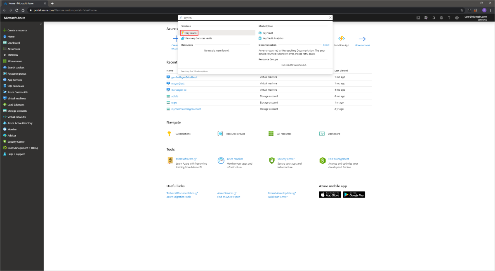
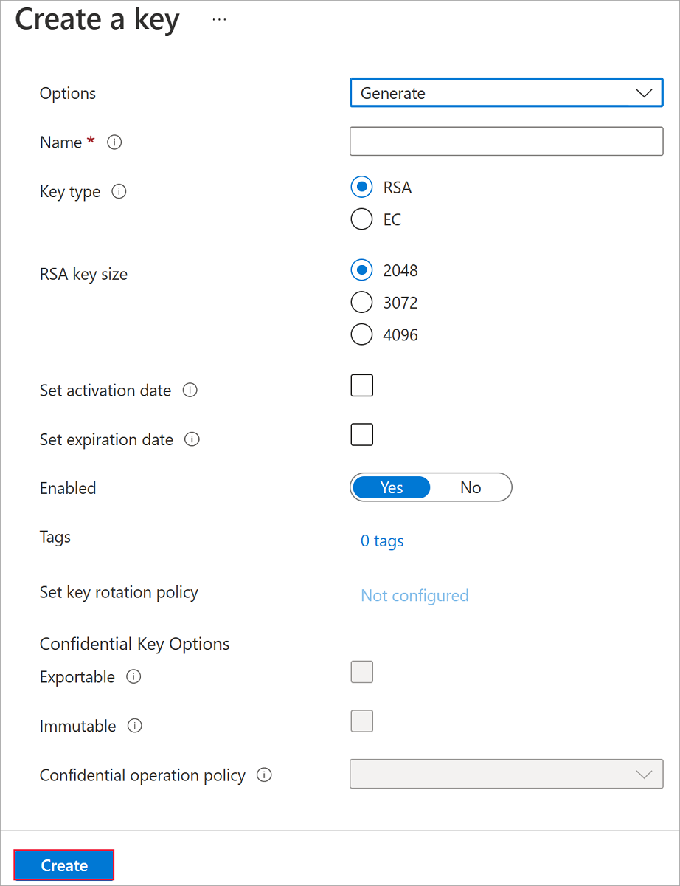
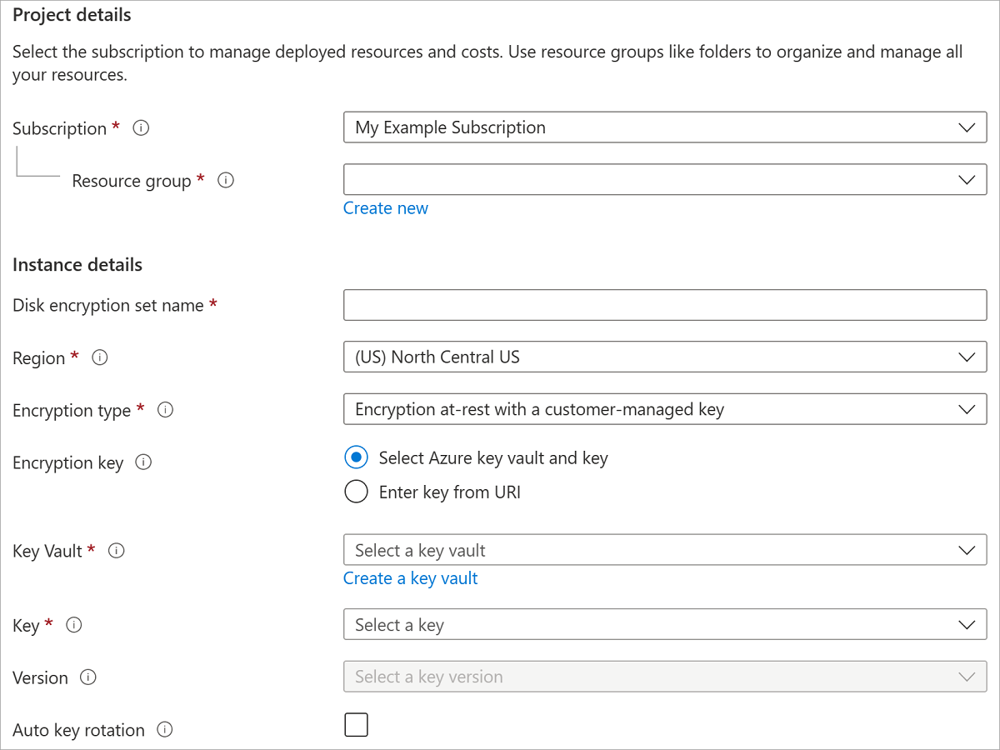

Setting up customer-managed keys for your disks will require you to create resources in a particular order, if you're doing it for the first time. First, you will need to create and set up an Azure Key Vault.

## Set up your Azure Key Vault

1. Sign into the [Azure portal](https://aka.ms/diskencryptionupdates).
1. Search for and select **Key Vaults**.

    

    > [!IMPORTANT]
    > Your Azure key vault, disk encryption set, VM, disks, and snapshots must all be in the same region and subscription for deployment to succeed.

1. Select **+Add** to create a new Key Vault.
1. Create a new resource group.
1. Enter a key vault name, select a region, and select a pricing tier.
1. Select **Review + Create**, verify your choices, then select **Create**.

    

1. Once your key vault finishes deploying, select it.
1. Select **Keys** under **Settings**.
1. Select **Generate/Import**.

    

1. Leave both **Key Type** set to **RSA** and **RSA Key Size** set to **2048**.
1. Fill in the remaining selections as you like and then select **Create**.

    

## Set up your disk encryption set

1. Search for **Disk Encryption Sets** and select it.
1. On the **Disk Encryption Sets** blade select **+Add**.

    

1. Select your resource group, name your encryption set, and select the same region as your key vault.
1. For **Encryption type** select **Encryption at-rest with a customer-managed key**.

    > [!NOTE]
    > Once you create a disk encryption set with a particular encryption type, it cannot be changed. If you want to use a different encryption type, you must create a new disk encryption set.

1. Select **Click to select a key**.
1. Select the key vault and key you created previously, as well as the version.
1. Press **Select**.
1. Select **Review + Create** and then **Create**.

    

1. Open the disk encryption set once it finishes creating and select the alert that pops up.

    

    Two notifications should pop up and succeed. This allows you to use the disk encryption set with your key vault.

    